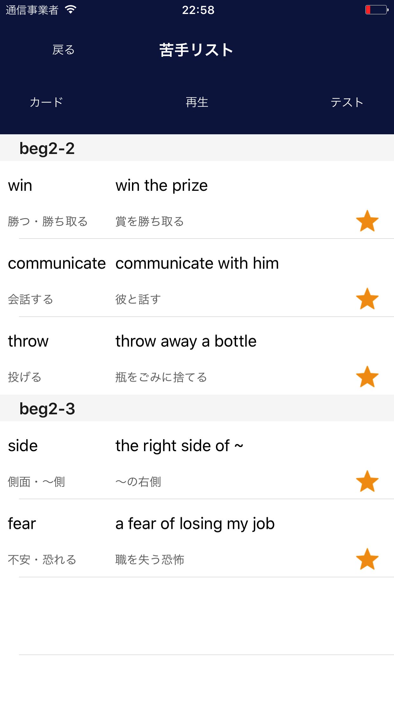

# 本アプリの説明
本アプリはiOS向け英単語学習用アプリです。  
対象：センター試験向けの基礎英単語を勉強したい人  
価格：無料

## Screenshots

### 単語タイマー

### 単語リスト

### 苦手な単語リスト

### 自動で覚える

### 単語テスト

### 単語カード

## 機能
- 英単語リスト表示
    - 英単語・日本語訳・フレーズ・フレーズ訳の４つを表示します
    - 苦手な単語を登録できます
    - 苦手な単語だけのリスト表示もできます
- 単語カード
    - カードをスワイプ操作でめくるようにして単語を覚えられます
- 単語テスト
    - 4択の単語テストができます
- 単語タイマー（**目玉機能！**）
    - 英単語・日本語訳を一定時間ごとに通知してくれます
    - ついついスマホをいじりがちな人もこれで自然に単語を見ることになり、自然に覚えられます

## 本アプリの技術的な構成
エンジニアの方向けに技術的な構成も説明します  
本アプリは大まかに以下の部分に分かれます  
- プログラム
- 英単語データ

### プログラム
言語：Swift3（そのうちSwift4になる予定。一部Objective-Cも補助的に使用）  

基本的に1画面＝1つのViewControllerの対応関係になっています。開発が進むにつれてクラスを使おうという考えが出てきたので中途半端にクラスファイルがあったりします。

構成  
- ViewController
    - HomeVC 
    - CategorySelectVC
    - などなど
- 補助クラス
    - Notificationなんとか
    - などなど

そのうちディレクトリ構成も改善します  
あと使ってないクラスとかもありそうなのでちゃんと確認します  

### 英単語データ
英単語データは自分で作成しました。このデータを自分で書き換えることでカスタマイズすることもできます。もしTOEIC・TOEFL用の単語ファイルを自作されましたら、提供いただけると嬉しいです。（いないと思いますが）  
英単語データは以下の６つの要素で構成されます  
- 1 英単語
- 2 英単語の日本語訳
- 3 1の単語を使ったフレーズ
- 4 フレーズの日本語訳
- 5 苦手な単語かどうかのフラグ（1or0)
- 6 品詞

ファイル内の見方
- 一単語一行   
- 6要素の区切り：半角アットマーク（@）  
- 一ファイルに２０単語

例：  
apple@りんご@I have an apple.@私はりんごを持っています@0@n  
pen@りんご@apple pen@アップルペン@0@n  

自作単語ファイルを作成する際の注意点：  
iPhoneの横幅を意識しないと単語やフレーズ・日本語訳がはみ出てしまいます。  
なので特にフレーズが長すぎにならないように気をつけましょう。  

ディレクトリ位置  
- tango/seedtango/  
- tango/dummytango/  

の二つの中にあります（その他、プログラムで生成されるディレクトリもありますがデフォルトではこの二つです）    

